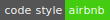

# Express.js - MongoDB - GraphQL

[](https://github.com/airbnb/javascript)

---

# HOW TO RUN

```bash
npm start
npm run watch
npm run lint
npm run lint-fix
```

# Source client

https://github.com/nguyentrucxinh/angular-graphql

# GraphQL

```js
// Read all
query {
    todo {
        _id,
        content,
        done
    }
}

// Read one
query {
    todo(_id: "5b44217d8f29b71d92844944") {
        _id,
        content,
        done
    }
}

// Create
mutation {
    createTodo(content: "todo I created") {
        _id,
        content,
        done
    }
}

// Update
mutation {
    checkTodo(_id: "5b44217d8f29b71d92844944") {
        _id,
        content,
        done
    }
}

// Delete
mutation {
    deleteTodo(_id: "5b44217d8f29b71d92844944") {
        _id,
        content,
        done
    }
}
```
